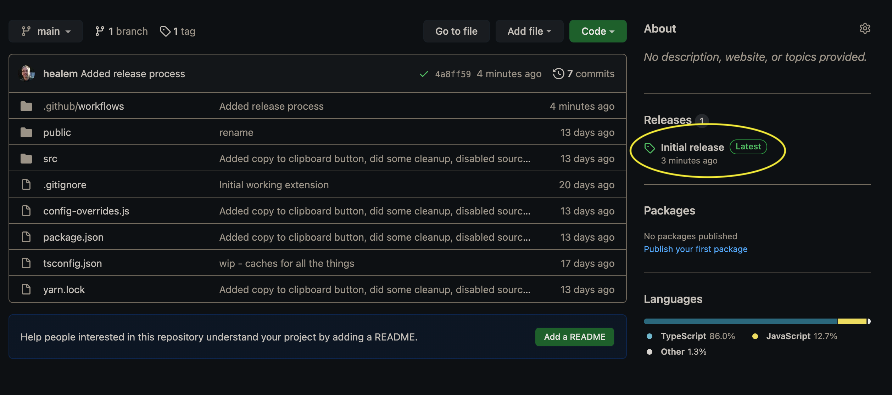
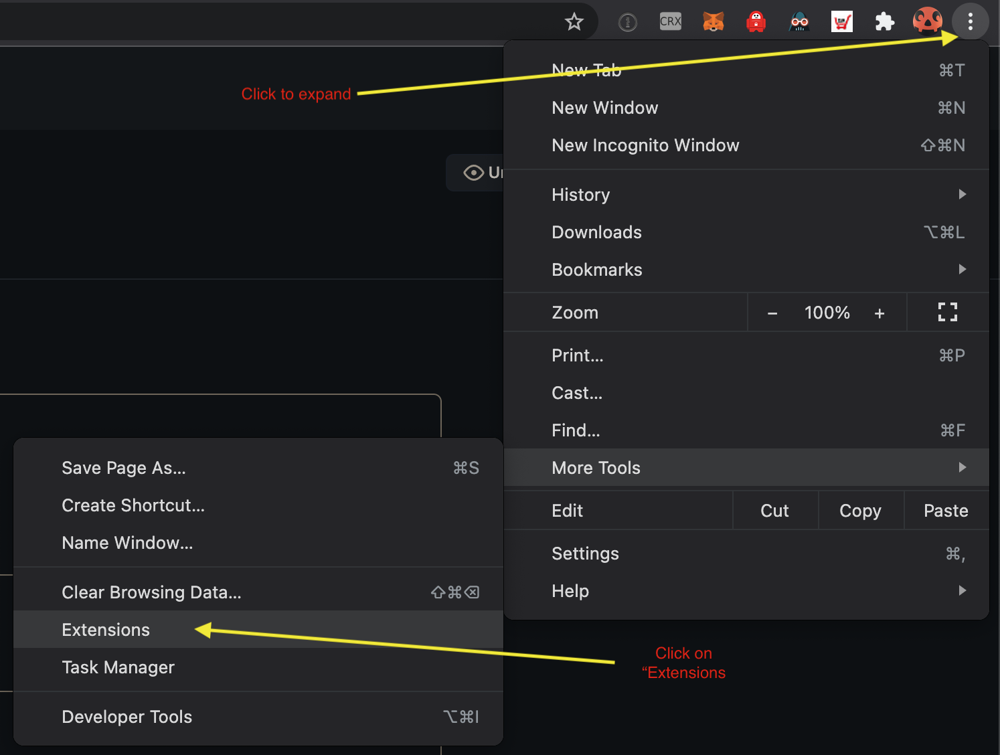
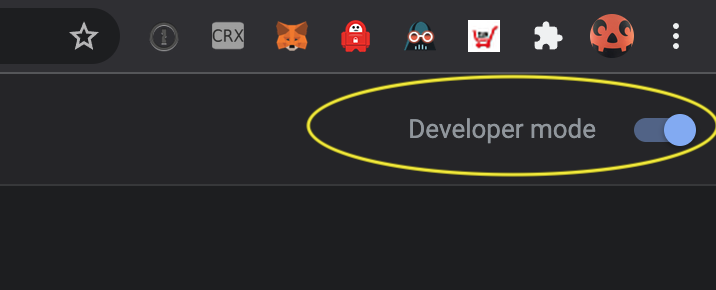
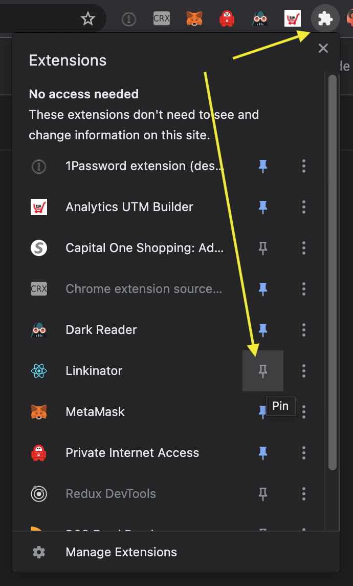

# Install the unpacked extension

1. Click on "Releases" on the right side of the Github repo 
2. Click on the desired Release version
3. Download "linkinator.zip"
4. Unzip "linkinator.zip" -> you should get a "build" folder with files in it.
5. Open up the Chrome Extensions tool:
   - Select the 3-dot menu in the upper right of your browser
   - Click on "More Tools"
   - Click on "Extensions" 
6. Make sure "Developer Mode" is enabled (upper right corner, just below 3-dot menu) 
7. Click on the "Load unpacked" button in the upper right of the window
8. Select the "build" folder you unzipped earlier
   - You should see a new extension appear in the main window
9. Make sure the extension is pinned to the URL bar:
   - Open the "Extensions" tool from the URL bar (looks like a puzzle piece outline)
   - Click the pin next to "Linkinator" 

Now you can use Linkinator.

# Basic use

To save a target website (a blog post you want to track) to cache, click on the Linkinator extension's icon in the URL bar and click the "Save" button in the extension popup.

Fill in the relevant UTM fields for your tracking process.  You can leave the fields you don't use blank.  Once done, copy/paste the URL at the bopttom (Tracked URL).
